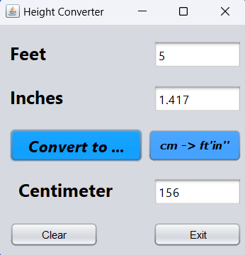

<h1> Udemy - Learn Java by building 17 projects step by step. </h1>

<h2>Index</h2>

- [Project 1: Height Converter ✅](#project-1-height-converter-)
- [Project 2: Word Count Tool ✅](#project-2-word-count-tool-)
- [Project 3: Weight Converter ⚒️](#project-3-weight-converter-️)
- [Project : Calculator](#project--calculator)
- [Project : Digital Clock](#project--digital-clock)
- [Project : Temperature Converter](#project--temperature-converter)
- [Project : Random Number Generator](#project--random-number-generator)
- [Project : BMI Calculator Tool](#project--bmi-calculator-tool)
- [Project : Percentage Calculator](#project--percentage-calculator)
- [Project : Add number  program](#project--add-number--program)
- [Project : Program to determine Even numbers](#project--program-to-determine-even-numbers)
- [Project : Program to determine Leap Year](#project--program-to-determine-leap-year)
- [Project : Program to calculate area  and perimeter of a circle](#project--program-to-calculate-area--and-perimeter-of-a-circle)
- [Project : Program to find highest number](#project--program-to-find-highest-number)
- [Project : Program to find Prime Numbers](#project--program-to-find-prime-numbers)
- [Project : Program to create a triangle](#project--program-to-create-a-triangle)
- [Project : Program to determine largest numbers](#project--program-to-determine-largest-numbers)

## Project 1: Height Converter ✅

[🎯 Project Link 🎯](./HeightConversion/dist/HeightConversion.jar)

	
	
	

## Project 2: Word Count Tool ✅

[🎯 Project Link 🎯](./WordCount/)

	
	

## Project 3: Weight Converter ⚒️
## Project : Calculator
## Project : Digital Clock
## Project : Temperature Converter

## Project : Random Number Generator
## Project : BMI Calculator Tool
## Project : Percentage Calculator
## Project : Add number  program
## Project : Program to determine Even numbers
## Project : Program to determine Leap Year
## Project : Program to calculate area  and perimeter of a circle
## Project : Program to find highest number
## Project : Program to find Prime Numbers
## Project : Program to create a triangle
## Project : Program to determine largest numbers
